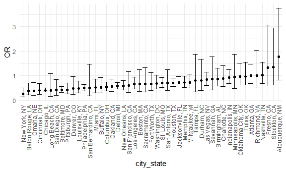
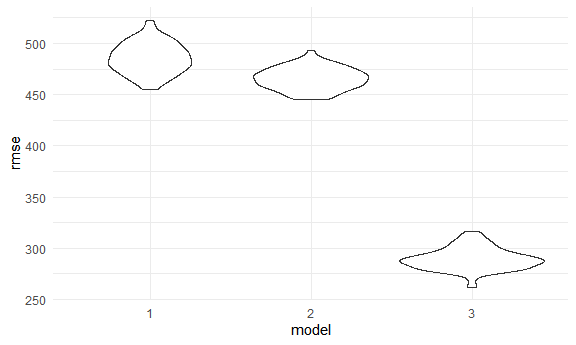
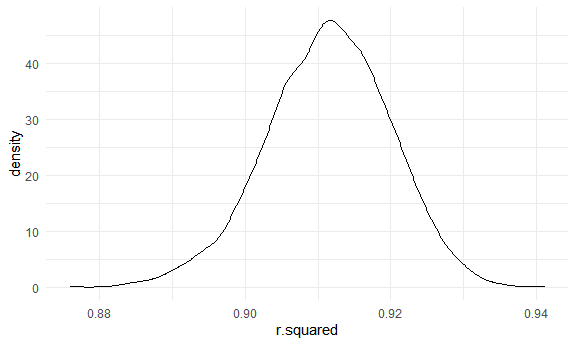
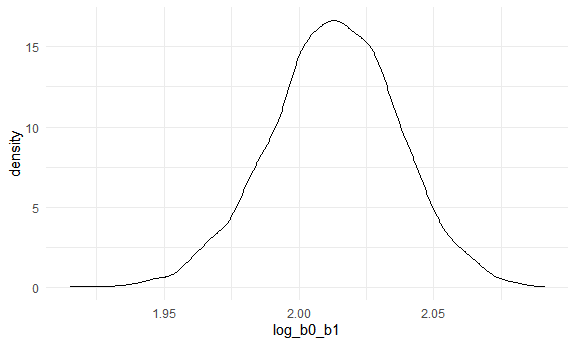

Homework 6
================

Hello\! And welcome to my solutions for Homework 6. Enjoy.

## Problem 1

Read in the data.

``` r
homicide_df = 
  read_csv("./data/homicide_data/homicide-data.csv", na = c("", "NA", "Unknown")) %>% 
  mutate(
    city_state = str_c(city, state, sep = ", "),
    victim_age = as.numeric(victim_age),
    resolution = case_when(
      disposition == "Closed without arrest" ~ 0,
      disposition == "Open/No arrest" ~ 0,
      disposition == "Closed by arrest" ~ 1
    )
  ) %>% 
  filter(
    victim_race %in% c("White", "Black"),
    city_state != "Tulsa_AL",
    city_state != "Tulsa, AL"
    ) %>% 
  select(city_state, resolution, victim_age, victim_race, victim_sex) %>% 
  view
```

    ## 
    ## -- Column specification --------------------------------------------------------
    ## cols(
    ##   uid = col_character(),
    ##   reported_date = col_double(),
    ##   victim_last = col_character(),
    ##   victim_first = col_character(),
    ##   victim_race = col_character(),
    ##   victim_age = col_double(),
    ##   victim_sex = col_character(),
    ##   city = col_character(),
    ##   state = col_character(),
    ##   lat = col_double(),
    ##   lon = col_double(),
    ##   disposition = col_character()
    ## )

Start with one city

``` r
baltimore_df = 
  homicide_df %>% 
  filter(city_state == "Baltimore, MD")

glm(resolution ~ victim_age + victim_race + victim_sex,
    data = baltimore_df, 
    family = binomial()) %>% 
  broom::tidy() %>% 
  mutate(
    OR = exp(estimate),
    CI_lower = exp(estimate - 1.96 * std.error),
    CI_upper = exp(estimate + 1.96 * std.error)
  ) %>% 
  select(term, OR, starts_with("CI")) %>% 
  knitr::kable(digits = 3)
```

| term              |    OR | CI\_lower | CI\_upper |
| :---------------- | ----: | --------: | --------: |
| (Intercept)       | 1.363 |     0.975 |     1.907 |
| victim\_age       | 0.993 |     0.987 |     1.000 |
| victim\_raceWhite | 2.320 |     1.648 |     3.268 |
| victim\_sexMale   | 0.426 |     0.325 |     0.558 |

Try this across cities.

``` r
model_results_df = 
  homicide_df %>% 
  nest(data = -city_state) %>% 
  mutate(
    models = map(.x = data, ~glm(resolution ~ victim_age + victim_race + victim_sex, data = .x, family = binomial())),
    results = map(models, broom::tidy)
  ) %>% 
  select(city_state, results) %>% 
  unnest(results)%>% 
  mutate(
    OR = exp(estimate),
    CI_lower = exp(estimate - 1.96 * std.error),
    CI_upper = exp(estimate + 1.96 * std.error)
  ) %>% 
  select(city_state, term, OR, starts_with("CI"))
```

``` r
model_results_df %>% 
  filter(term == "victim_sexMale") %>% 
  mutate(city_state = fct_reorder(city_state, OR)) %>% 
  ggplot(aes(x = city_state, y = OR))+
  geom_point() +
  geom_errorbar(aes(ymin = CI_lower, ymax = CI_upper))+
  theme(axis.text.x = element_text(angle = 90, vjust = 0.5, hjust = 1))
```



## Problem 2

Firstly, let’s read in the data and fit a model that may explain
birthweight.

``` r
baby_df = read_csv("./data/birthweight_data/birthweight.csv") %>% 
  mutate(
    babysex = as.factor(babysex), 
    frace = as.factor(frace),
    malform = as.factor(malform),
    mrace = as.factor(mrace)
  )
```

    ## 
    ## -- Column specification --------------------------------------------------------
    ## cols(
    ##   .default = col_double()
    ## )
    ## i Use `spec()` for the full column specifications.

``` r
model_1 = lm(bwt ~ momage * delwt, data = baby_df)

baby_df %>% 
  add_predictions(model_1) %>%
  add_residuals(model_1) %>% 
  ggplot(aes(x = resid, y = pred))+
  geom_point()+
  labs(title = "Plot of model residuals against fitted values")
```


Now, let’s compare this first model to two other models and see which
one has the smallest RSME.

``` r
model_2 = lm(bwt ~ gaweeks, data = baby_df)
model_3 = lm(bwt ~ bhead * blength * babysex, data = baby_df)

cv_df = crossv_mc(baby_df, 100)

cv_df = 
  cv_df %>% 
  mutate(
    train = map(train, as_tibble),
    test = map(test, as_tibble)
  )


cv_df = 
  cv_df %>% 
  mutate(
    model_1 = map(.x = train, ~lm(bwt ~ momage * delwt, data = .x)),
    model_2 = map(.x = train, ~lm(bwt ~ gaweeks, data = .x)),
    model_3 = map(.x = train, ~lm(bwt ~ bhead * blength * babysex, data = .x))
  ) %>% 
  mutate(
    rmse_1 = map2_dbl(.x = model_1, .y = test, ~rmse(model = .x, data = .y)),
    rmse_2 = map2_dbl(.x = model_2, .y = test, ~rmse(model = .x, data = .y)),
    rmse_3 = map2_dbl(.x = model_3, .y = test, ~rmse(model = .x, data = .y))
  )

cv_df %>% 
  select(starts_with("rmse")) %>% 
  pivot_longer(
    everything(), 
    names_to = "model",
    values_to = "rmse",
    names_prefix = "rmse_"
  ) %>% 
  ggplot(aes(x = model, y = rmse))+
  geom_violin()
```



``` r
cv_df %>% 
  select(starts_with("rmse")) %>% 
  pivot_longer(
    everything(), 
    names_to = "model",
    values_to = "rmse",
    names_prefix = "rmse_"
  ) %>% 
  group_by(model) %>% 
  summarize(avg_rsme = mean(rmse))
```

    ## `summarise()` ungrouping output (override with `.groups` argument)

    ## # A tibble: 3 x 2
    ##   model avg_rsme
    ##   <chr>    <dbl>
    ## 1 1         485.
    ## 2 2         466.
    ## 3 3         290.

Model 3 does the best at explaining the relationship.

## Problem 3

``` r
weather_df = 
  rnoaa::meteo_pull_monitors(
    c("USW00094728"),
    var = c("PRCP", "TMIN", "TMAX"), 
    date_min = "2017-01-01",
    date_max = "2017-12-31") %>%
  mutate(
    name = recode(id, USW00094728 = "CentralPark_NY"),
    tmin = tmin / 10,
    tmax = tmax / 10) %>%
  select(name, id, everything())
```

    ## Registered S3 method overwritten by 'hoardr':
    ##   method           from
    ##   print.cache_info httr

    ## using cached file: C:\Users\matth\AppData\Local\Cache/R/noaa_ghcnd/USW00094728.dly

    ## date created (size, mb): 2020-10-08 14:54:57 (7.54)

    ## file min/max dates: 1869-01-01 / 2020-10-31

``` r
weather_model = lm(tmax ~ tmin, data = weather_df) 

weather_results = 
  weather_df %>% 
  bootstrap(5000, id = "strap_number") %>% 
  mutate(
    models = map(.x = strap, ~lm(tmax ~ tmin, data = .x)),
    r_squared = map(models, broom::glance),
    logs = map(models, broom::tidy)
  ) %>% 
  unnest(r_squared) %>% 
  select(strap_number, r.squared, logs) %>% 
  unnest(logs) %>% 
  select(strap_number, r.squared, term, estimate) %>% 
  pivot_wider(
    names_from = "term",
    values_from = "estimate"
  ) %>% 
  rename(
    beta_0 = "(Intercept)",
    beta_1 = "tmin"
  ) %>% 
  mutate(
    log_b0_b1 = log((beta_0 * beta_1))
  ) %>% 
  select(r.squared, log_b0_b1)
```

Let’s plot the data.

``` r
weather_results %>% 
  ggplot(aes(x = r.squared))+
  geom_density()
```



``` r
weather_results %>% 
  ggplot(aes(x = log_b0_b1))+
  geom_density()
```



These two plots are seemingly standard bell curve. The r squared
estimate is slightly left skewed.

Let’s identify the confidence intervals for these estimates

``` r
ci_r = 
  weather_results %>%
  pull(r.squared) %>% 
  quantile( c(0.025, 0.975)) %>% 
  knitr::kable( caption = "95% Confidence Interval for R Squared Estimate")

ci_r
```

|       |         x |
| :---- | --------: |
| 2.5%  | 0.8935713 |
| 97.5% | 0.9271792 |

95% Confidence Interval for R Squared Estimate

``` r
ci_logs = 
  weather_results %>%
  pull(log_b0_b1) %>% 
  quantile( c(0.025, 0.975))%>% 
  knitr::kable( caption = "95% Confidence Interval for log(β̂0∗β̂) Estimate")

ci_logs
```

|       |        x |
| :---- | -------: |
| 2.5%  | 1.964035 |
| 97.5% | 2.059049 |

95% Confidence Interval for log(ß^0\*ß^) Estimate
